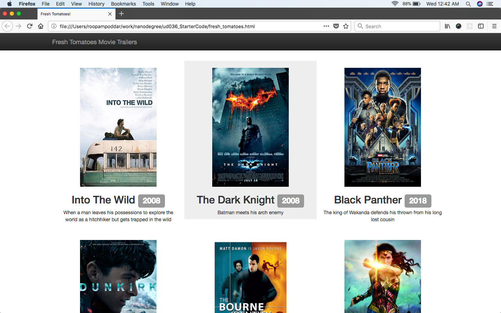

## Movie Website Creator
This code creates a movie directory website using the details 
given in the form of a python object list.

#### System Requirements
* Python 2.7 
* Web Browser 

#### Files
1. `media.py` : has class definition for the Movie object
2. `fresh_tomatoes.py` : has code to create the html file
3. `entertainment_center.py`: creates movie objects and calls fresh_tomatoes.py with this data.

#### How to Run
1. Clone this repository using `git clone`
2. Create the html file by running command: `python entertainment_center.py`. This will create an html file by the name of `fresh_tomatoes.html`
4. Open `fresh_tomatoes.html` in the browser

